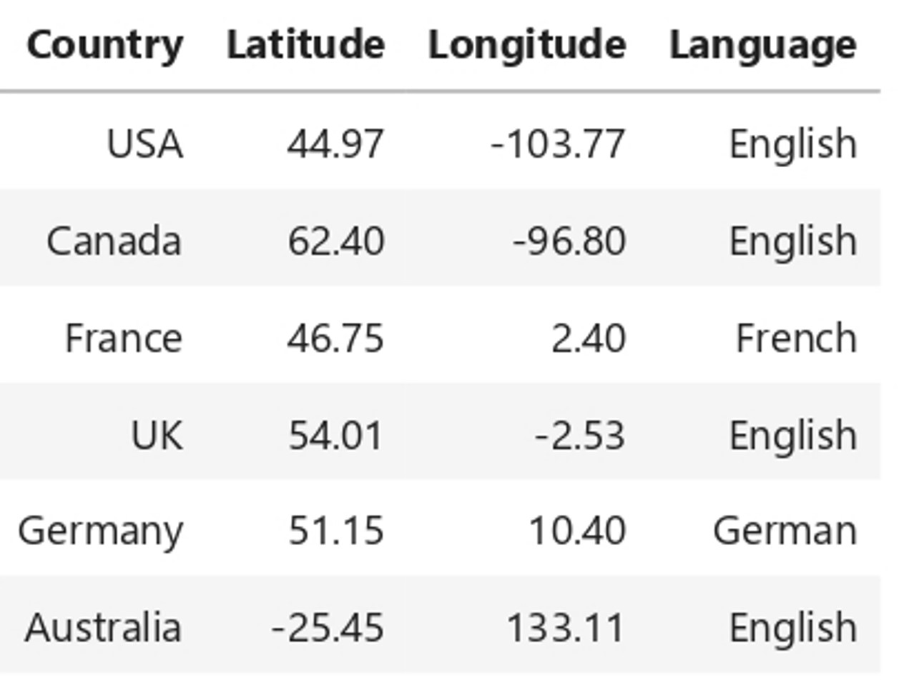
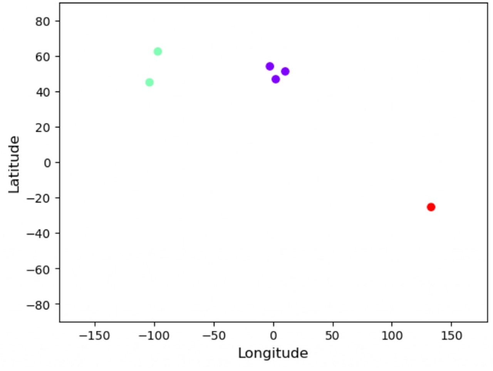
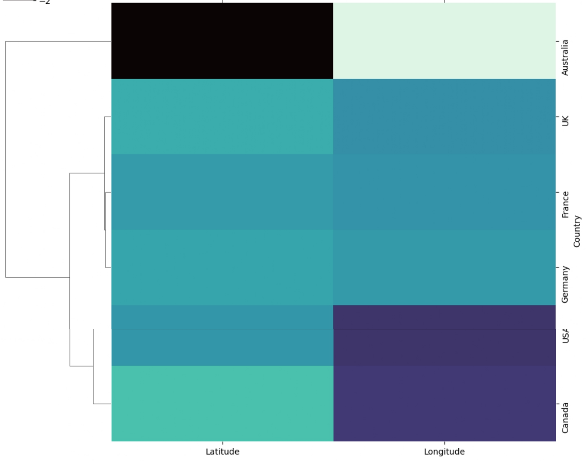
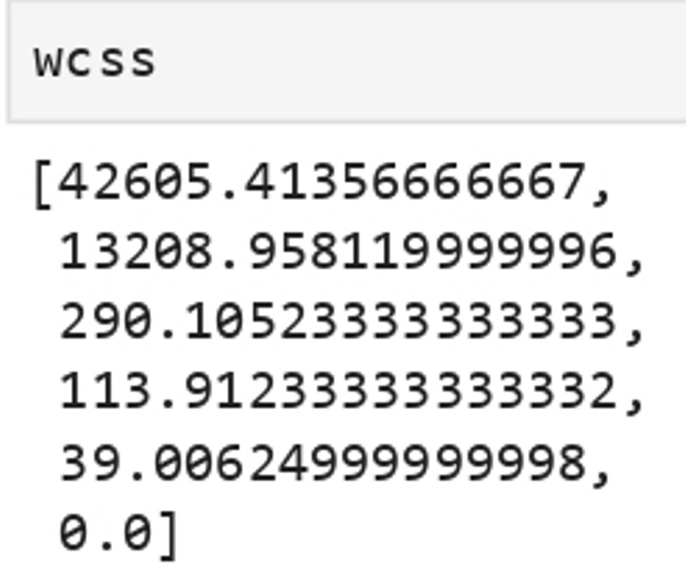
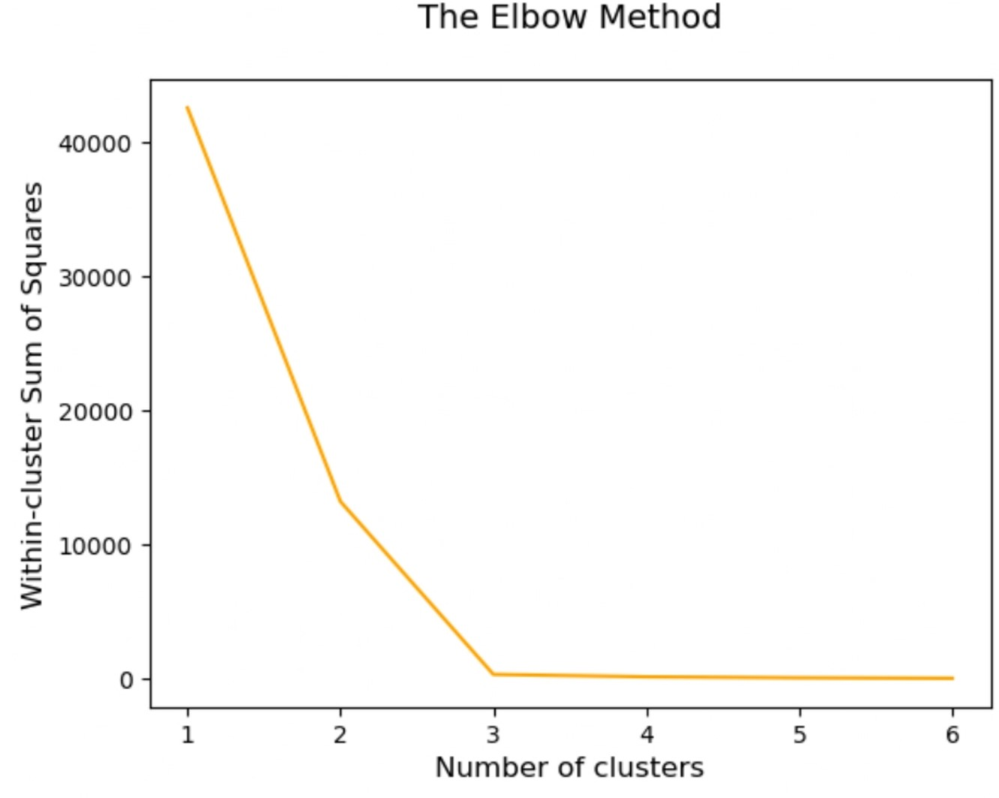
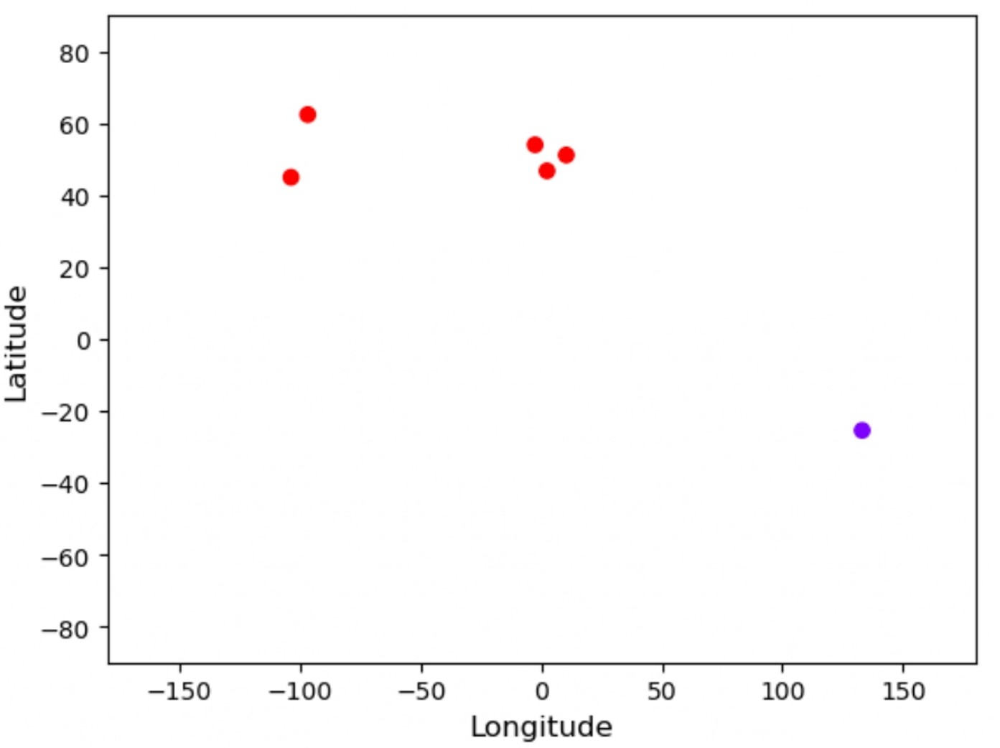

# Machine Learning Project Using KMeans to Country Clustering

## Project Description

**Problem :**  
In our increasingly interconnected world, understanding global patterns based on geographical location and linguistic diversity is crucial for various applications. This project aims to leverage the geographic coordinates (latitude and longitude) and primary language spoken in each country to group them into clusters.

**Challenges :**  
Build a machine learning model that can clustering country based on their regional & language.

## Project Goal

The goal is to uncover meaningful insights into regional similarities, linguistic affiliations, and potential correlations between geography and language.

## Tools & Library Used

 &nbsp;
 &nbsp;

## Project Result

[Click here to get full code](https://github.com/nickenshidqia/Country_Clustering_Using_KMeans_Unsupervised_Learning/blob/658d018aa30125a69f05f106003eba08773ce78d/Country%20cluster.ipynb)

### Simple K-Means Clustering

**Dataset :**  

#### A. Clustering Based On Longitude and Latitude

From 6 country, we clustering them based on their geographical location, so we select the features latitude and longitude. There are 3 clusters

- green dots = USA & Canada
- purple dots = France, UK, Germany
- red dots = Australia

**Heatmap & Dendogram**  

There are 2 features :

- Latitude
- Longitude

There are 6 observations :

- Australia
- UK
- France
- Germany
- USA
- Canada

Insight :

- In terms of Latitude, only Australia has different color (dark blue), because other country is located in Northern Hemisphere, while Australia is located in Southern Hemisphere
- Germany, France, and UK has similar color ==> cluster 1
- USA, and Canada has similar color in terms of longitude, and slight difference on latitude ==> cluster 2
- Australia is compeletely different in both latitude and longitude => cluster 3

#### B. Clustering Based On Language:\*

Clustering is about :

- minimizing the distance between points in a cluster
- maximizing the distance between clusters
  distance between points in a cluster ==> WCSS (Within Cluster Sum of Squares)

If we minimize WCSS, we have reached the perfect clustering solution
But there's problem:

- observation: 1,000, cluster = 1,000, WCSS=0 (min)
- observation: 1,000, cluster = 1 WCSS= max
- What we want : WCSS middle Ground ==> - observation: N, cluster = small, WCSS= low ==> Elbow Method
- **Elbow Method** ==> the biggest number of clusters for which still getting significant decrease in WCSS

**WCSS (Within-Cluster Sum of Squares)**  
  
We've got 6 WCSS and then we're gonna implement it to The Elbow Method to find the best of number of clustering to use.

**Elbow Method**  

- 3 cluster is the best solution
- 2 cluster solution would be suboptimal as the leap from 2 to 3 is very big in terms of WCSS.

In this project, we plot 2 cluster based on their language :

